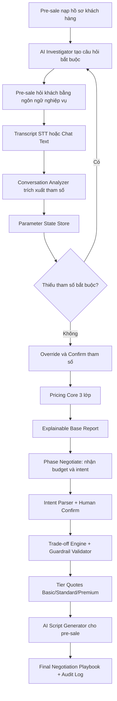

# [ID-Đội thi] - Đề tài 5: AI-Driven Pricing Recommendation System
**Giải pháp Đề xuất Định giá Tự động với 3 Phương án, Breakdown, Margin & Effort**

---

## 1. Vấn đề và Người dùng (Problem & Target Audience)

### 1.1. Bài toán đang giải quyết
*(Mô tả ngắn gọn khó khăn hiện tại của doanh nghiệp khi làm báo giá)*
*   **Vấn đề:** Quá trình định giá phần mềm/dự án CNTT hiện tại phụ thuộc nhiều vào kinh nghiệm cá nhân (heuristic), dễ dẫn đến sai số (under-estimate hoặc over-estimate).
*   **Khó khăn:** Mất nhiều thời gian để tính toán Effort (công sức), đánh giá Risk (rủi ro) và ra quyết định Margin (biên lợi nhuận) phù hợp để vừa có lãi, vừa trúng thầu. Thiếu cơ chế đưa ra các rổ giá (Tiers) linh hoạt cho khách hàng.

### 1.2. Người dùng mục tiêu (Persona)
*   **Pre-sales / Solution Architect:** Người trực tiếp nhập liệu, thiết kế hệ thống và cần tính toán Base Cost.
*   **Sale / Account Manager:** Người cần các phương án giá (3 Tiers) để đàm phán với khách hàng.
*   **C-Level / Quản lý:** Người phê duyệt Margin và đánh giá rủi ro (Risk & Complexity) của dự án.

---

## 2. Cách làm và Kiến trúc Tổng quan (High-level Architecture & Approach)

### 2.1. Tư tưởng thiết kế cốt lõi (First Principles)

Hệ thống được thiết kế theo triết lý "AI mềm + Core cứng + Human-in-the-loop", nhằm giữ cân bằng giữa linh hoạt hội thoại và an toàn tài chính:

1. **AI mềm (Probabilistic):** chỉ làm nhiệm vụ hiểu ngôn ngữ tự nhiên, trích xuất tín hiệu, gợi ý câu hỏi, sinh diễn đạt cho pre-sale.
2. **Core cứng (Deterministic):** toàn bộ con số tiền, effort, risk multiplier, margin, floor price phải do công thức và rule engine tính.
3. **Con người quyết định cuối:** pre-sale và quản lý có quyền xác nhận/chỉnh sửa tham số kèm lý do, AI không tự chốt giá.
4. **Tách biến động và hằng số:** tham số khách hàng là động theo từng deal; tham số công ty (rate, margin policy, discount policy) là cấu hình tĩnh.
5. **Rủi ro là tích số:** dùng COCOMO Effort Multipliers theo phép nhân để giữ được hiệu ứng cộng hưởng rủi ro.

---

### 2.2. User Workflow End-to-End (Phase Discovery -> Phase Pricing)

#### A. Phase Discovery: tìm đủ tham số định giá

1. **Pre-sale nạp hồ sơ công ty khách hàng** (company profile, brief, tài liệu trao đổi ban đầu).
2. **AI trích xuất tham số khởi tạo** theo mức độ chi tiết của hồ sơ: ngành, mô-đun khả dụng, quy mô user, timeline, context vận hành.
3. **AI ưu tiên sinh bộ câu hỏi bắt buộc** xoay quanh:
    - module phần mềm cần thiết;
    - số user và hành vi sử dụng;
    - các yếu tố ảnh hưởng chi phí/rủi ro (data, integration, literacy).
4. **Pre-sale hỏi khách hàng theo ngôn ngữ nghiệp vụ** (không hỏi kỹ thuật thuần), ví dụ:
    - "Bên anh đang lưu dữ liệu chủ yếu bằng Excel hay đã có phần mềm tập trung?"
    - thay vì hỏi trực tiếp về kiến trúc DB/API mà khách khó trả lời.
5. **AI lắng nghe hội thoại** qua:
    - transcript từ speech-to-text có phân biệt speaker (pre-sale vs khách);
    - hoặc text chat/tin nhắn giữa hai bên.
6. **Sau mỗi hiệp trao đổi, pre-sale nhấn Analyze:**
    - AI trích xuất/ cập nhật tham số;
    - gắn confidence, evidence (trích dẫn), reasoning;
    - sinh câu hỏi tiếp theo cho tham số còn thiếu.
7. **Pre-sale xác nhận lại với khách hàng** dựa trên tham số AI đã trích xuất (có dẫn chứng + lý do).
8. **Nếu có ý kiến khác:** pre-sale hoặc khách hàng được chỉnh tham số kèm lý do override.
9. **Lặp vòng Discovery** cho đến khi:
    - đủ tham số bắt buộc, hoặc
    - xác định rõ tham số nào chưa chắc chắn và chấp nhận dùng default có cảnh báo.

#### B. Phase Pricing: tính giá cơ sở theo 3 lớp

1. Pre-sale nhấn "Tính giá cơ sở".
2. Hệ thống lấy bộ tham số đã xác nhận đưa vào công thức 3 lớp.
3. Trả về base quote kèm breakdown, risk, margin, và report explainable.
4. Báo cáo phải ghi lại:
    - tham số dùng để tính;
    - trích dẫn và reasoning của từng tham số;
    - lịch sử override và người phê duyệt.

---

### 2.3. Cơ sở tính giá: mô hình 3 lớp và phân rã tham số

#### Lớp 1: Base Cost (giá vốn cứng)

$$Cost_{Base} = License_{Cost} + Server_{Cost} + (ManDays_{Base} \times Rate_{Burdened} \times EM_{B1})$$

Trong đó:

1. **License_Cost**: chi phí bản quyền theo module catalog, đã xét reuse.
2. **Server_Cost**: chi phí hạ tầng theo tải sử dụng và dung lượng dữ liệu.
3. **ManDays_Base x Rate_Burdened**: effort chuẩn nhân đơn giá nhân sự đã gồm overhead.
4. **EM_B1 (Deployment Location)**: hệ số onsite/remote.

Phân rã tham số con ảnh hưởng Lớp 1:

1. **License_Cost**
    - danh sách module cần triển khai;
    - base license của từng module;
    - reuse factor (tỷ lệ tái sử dụng).
2. **Server_Cost**
    - concurrent users;
    - cost per 100 users;
    - storage GB và cost/GB;
    - high availability requirement.
3. **Rate_Burdened**
    - mix Senior/Junior/PM/BA;
    - location (onsite multiplier);
    - chính sách chi phí nội bộ.

Chi tiết công thức cấu phần:

$$License_{Cost} = \left(\sum_{i=1}^{n} Module_i.License\_Base\_Price\right) \times (1 - Reuse_{Factor})$$

$$Server_{Cost} = Base_{Infra} + \left(\left\lceil\frac{Concurrent\_Users}{100}\right\rceil \times Cost_{100Users}\right) + (Total\_GB\_Est \times Cost_{GB}) \times (1 + HA_{Multiplier})$$

#### Lớp 2: Risk & Complexity (COCOMO Effort Multipliers)

$$Effort_{Adjusted} = ManDays_{Base} \times EM_{D1} \times EM_{D2} \times EM_{D3} \times EM_{I1} \times EM_{I2} \times EM_{T1} \times EM_{T2}$$

$$Cost_{Adjusted} = Effort_{Adjusted} \times Rate_{Burdened} + Hardware \times EM_{B2}$$

Nhóm tham số con ảnh hưởng Lớp 2:

1. **Data Risk**
    - EM_D1: Data Format (SQL/API có cấu trúc vs Excel/PDF/scan);
    - EM_D2: Data Volume (2 năm vs 10 năm);
    - EM_D3: Data Integrity (sạch/chuẩn vs rác/trùng/thiếu trường).
2. **Integration Risk**
    - EM_I1: API Availability (mở API hay hệ đóng);
    - EM_I2: Legacy System Age (tuổi đời hệ thống cũ).
3. **Tech Literacy Risk**
    - EM_T1: End-user Age Profile;
    - EM_T2: Prior System Experience.

Lưu ý phương pháp:

1. Rủi ro dùng phép nhân, không cộng phẳng.
2. Mỗi EM có min/max guardrail từ heuristic matrix.
3. AI chỉ được chọn giá trị trong biên cho phép và phải có evidence.

#### Lớp 3: Commercial & Margin

$$Price_{Final} = \frac{Cost_{Adjusted}}{1 - Margin_{\%}} \times EM_{C1} \times EM_{C2} \times (1 - Discount_{C3})$$

Phân rã tham số con ảnh hưởng Lớp 3:

1. **Margin_%**
    - net profit;
    - risk premium;
    - reinvestment;
    - commission (nếu có đối tác).
2. **EM_C1 (Rush Factor)**
    - timeline và mức độ gấp.
3. **EM_C2 (Client Logo Strategy)**
    - enterprise/mid-market/SMB để điều chỉnh hệ số chiến lược.
4. **Discount_C3 (Payment Term)**
    - trả trước, trả theo mốc, hay công nợ kéo dài.

---

### 2.4. Kiến trúc tổng quan thành phần hệ thống (High-level Components)

1. **Profile Intake & Context Builder**
    - nạp hồ sơ khách hàng, normalize đầu vào.
2. **AI Investigator**
    - sinh câu hỏi bắt buộc theo missing slots;
    - tối ưu ngôn ngữ hỏi theo nghiệp vụ (tránh hỏi kỹ thuật khó).
3. **Conversation Analyzer**
    - nhận transcript STT hoặc message text;
    - trích xuất tham số + evidence + confidence + reasoning.
4. **Parameter State Store**
    - lưu trạng thái slot qua từng vòng hỏi đáp;
    - theo dõi thiếu/đủ/unknown.
5. **Override & Approval Console**
    - pre-sale/manager chỉnh tham số;
    - bắt buộc ghi lý do và lưu audit.
6. **Pricing Core (Deterministic)**
    - Base Cost Calculator;
    - EM Calculator;
    - Commercial Calculator.
7. **Explainability Composer**
    - sinh report nội bộ/khách hàng;
    - map con số -> evidence -> reasoning.
8. **Negotiation Core**
    - Tier Pricing Engine (Basic/Standard/Premium);
    - Trade-off Engine (budget gap solver);
    - Guardrail Validator (dependency/operation/legal/margin floor).
9. **Negotiation Advisory AI**
    - parser transcript đàm phán -> intent candidate;
    - script generator cho pre-sale trình bày phương án.

---

### 2.5. Workflow giai đoạn đàm phán giá (Phase Negotiate)

Sau khi có base quote, hệ thống chuyển sang vòng đàm phán:

1. **Pre-sale đưa khoảng giá mở đầu** dựa trên giá cơ sở và chiến lược thương mại.
2. **Khách hàng đưa budget/điều kiện đàm phán** (giảm giá, thêm bớt feature, thay đổi dịch vụ).
3. **AI parser đọc transcript đàm phán** và trích xuất:
    - budget candidate;
    - tier ưu tiên;
    - capability phía khách;
    - ý định đàm phán.
4. **Human confirmation bắt buộc:** pre-sale xác nhận/ sửa intent trước khi chạy engine quyết định.
5. **Trade-off Engine đề xuất tối đa 3 playbook**
    - phương án cắt giảm để tạo Basic;
    - phương án giữ đầy đủ cho Standard;
    - phương án mở rộng cho Premium.
6. **Guardrail kiểm tra ràng buộc**
    - không vỡ dependency module;
    - không chuyển trách nhiệm khi khách không đủ capability;
    - không rơi dưới floor margin;
    - thêm clause bắt buộc nếu có risk transfer.
7. **AI Script Generator chuyển kết quả cứng thành lời thoại mềm** để pre-sale trình bày trong cuộc họp.

---

### 2.6. Cơ chế Explainability, Override và Audit

Mỗi tham số trong báo cáo cần có đầy đủ metadata:

1. value;
2. confidence (high/medium/low);
3. source (direct statement, inferred, default);
4. evidence (trích dẫn câu nói);
5. reasoning (vì sao map ra tham số);
6. override info (ai sửa, sửa gì, lý do, thời điểm).

Mục tiêu là đảm bảo báo giá có thể trả lời được 3 câu hỏi:

1. "Con số này đến từ đâu?"
2. "Ai đã thay đổi con số này?"
3. "Nếu đổi giả định thì giá thay đổi thế nào?"

---

### 2.7. Sơ đồ luồng kiến trúc tổng quan (Architecture Diagram)

---

### 2.8. Nguồn tham chiếu cho phần Kiến trúc

1. KHantix_doc/outputs/KHantix - Phân rã tham số định giá (FP0).md
2. KHantix_doc/outputs/KHantix - Phân rã Lớp 2 COCOMO Effort Multipliers.md
3. KHantix_doc/outputs/KHantix - Explainable Report & Pre-sales Override (Phase 2).md
4. KHantix_doc/outputs/KHantix - R&D Deal Giá 3 Tiers (Phase 3).md
5. KHantix_doc/outputs/KHantix - Chiến dịch đặt câu hỏi (Interview Strategy).md
6. KHantix_doc/outputs/KHantix - Hướng Hybrid System.md
7. KHantix_doc/requirements/internal_configs.csv
8. KHantix_doc/requirements/module_catalog.csv
9. KHantix_doc/requirements/heuristic_matrix_v2.csv

---

## 3. Giá trị mang lại & Cách đo lường hiệu quả (Value & Metrics)

### 3.1. Giá trị giải pháp (Business Value)
*   **Tính minh bạch (Explainability):** Break-down rõ ràng số Man-days, lý do áp dụng Risk, và thành phần tạo nên giá trị gói.
*   **Tăng tốc độ (Speed):** Rút ngắn thời gian lập báo giá từ vài ngày xuống còn vài giờ/vài phút.
*   **Tối ưu đàm phán (Win-rate):** 3 phương án giá giúp khách hàng có sự lựa chọn (Anchoring effect), tránh việc chỉ trả lời "Có/Không" với khách hàng.

### 3.2. Đo lường hiệu quả (Success Metrics / KPIs)
*(Cách nhóm chứng minh sản phẩm "đáng dùng")*
1.  **Rút ngắn thời gian:** % thời gian giảm thiểu khi tạo một báo giá mới chuẩn xác.
2.  **Độ chính xác (Accuracy):** Mức độ sai lệch (variance) giữa giá dự kiến hệ thống đưa ra và giá chốt thực tế.
3.  **Tỷ lệ Win-rate:** Khả năng chốt deal tăng lên nhờ chiến lược giá 3 Tiers.

---

## 4. [Khuyến khích] Đề án Kinh doanh & Demo (Optional)

### 4.1. Kịch bản Demo (Demo Scenario Walkthrough)
*   *Bước 1:* Sale nhập mô tả dự án từ khách hàng bằng văn bản (hoặc file).
*   *Bước 2:* Hệ thống tự động phân tách các Module, gợi ý Base Cost (Lớp 1).
*   *Bước 3:* Sale chọn các yếu tố môi trường, hệ thống tính toán Risk (Lớp 2).
*   *Bước 4:* Hệ thống xuất ra bảng Excel/PDF Report với 3 Tiers (Lớp 3) đi kèm giải thích.

### 4.2. Business Case (Tương lai của sản phẩm)
*   Nếu phát triển thành SaaS Product, có thể bán cho các công ty Outsourcing/SI dưới dạng Subscription (Tính phí theo số lượng Báo giá/tháng hoặc User).