# Khantix — Kế hoạch Thực thi Kỹ thuật: UX Copilot cho Pre-sales

> [!IMPORTANT]  
> **Mục tiêu cốt lõi:** Ngừng việc dùng AI như một "Chatbot tư vấn tự động". Chuyển đổi Khantix thành một **"Silent Copilot"** (Trợ lý thầm lặng) đứng sau màn hình của Pre-sales, lắng nghe toàn bộ cuộc họp, tự động bóc tách tham số và gợi ý câu hỏi tiếp theo. 

---

## 1. Kiến trúc Luồng Dữ Liệu (The New Data Flow)

UX Copilot sẽ loại bỏ thanh chat truyền thống `(Khách hàng ↔ AI)` và thay thế bằng `(Pre-sales nhập dữ liệu ➔ AI phân tích ➔ Dashboard hiển thị)`.

```mermaid
sequenceDiagram
    participant C as Khách hàng
    participant P as Pre-sales (Sales)
    participant K as Khantix (AI Copilot)
    
    rect rgb(30, 40, 50)
    Note over C,K: GIAI ĐOẠN 0: LỌC HỒ SƠ (Pre-qualification)
    P->>K: Nạp file "Hồ sơ trước báo giá.md"
    K-->>P: Nếu là sinh viên/budget rác: Báo lỗi "TỪ CHỐI SCOPING"
    K-->>P: Nếu hợp lệ: Cập nhật các EM có thể đoán trước vào Dashboard
    end
    
    rect rgb(30, 40, 50)
    Note over C,K: GIAI ĐOẠN 1: HIỆP TRÒ CHUYỆN 1
    C->>P: Trò chuyện (Voice/Text)
    P->>K: Nạp log hội thoại (Transcript) vào hệ thống
    K-->>P: Bóc tách tham số (Data, Server, Users...) ➔ Gán vào EM Cards
    P->>C: "Dạ em xin xác nhận lại anh có 3 kho đúng không ạ..." (Validate)
    P->>K: Nhấn [Confirm] hoặc Override thay đổi thanh trượt
    K-->>P: Gợi ý: [Bullet list các câu hỏi cần hỏi tiếp theo]
    end
    
    rect rgb(30, 40, 50)
    Note over C,K: GIAI ĐOẠN 2: BÁO CÁO NHANH (On-demand Reporting)
    P->>K: Nhấn nút [Tạo Báo Cáo Base Price] (Bất kể đã đủ EM chưa)
    K-->>P: Render Base Price (Labor + License + Server). In ra danh sách cấu trúc: ✅ Đã tìm được & ❌ Bị thiếu.
    end
```



---

## 2. Kế hoạch Code (Implementation Steps)

### Bước 1: API Nạp & Lọc "Hồ sơ trước báo giá"
- **Input:** Khung text (hoặc upload file `.md`) chứa tóm tắt: Tên công ty, Ngành, Vấn đề cốt lõi, Budget dự kiến (nếu có).
- **AI Task (Bouncer Logic):**
  - Chạy qua 1 prompt kiểm tra (Classification).
  - Nếu từ khoá rơi vào `[sinh viên, bài tập, cá nhân]`, AI nổ lỗi HTTP 400: `⚠️ REJECTED: Hệ thống chuyên biệt B2B Enterprise, không phục vụ đồ án cá nhân`.
  - Nếu hợp lệ: AI trích xuất trước các `EffortMultiplierEstimate` tương ứng và điền sẵn vào Session (VD: Nhìn thấy "Chuỗi 15 cửa hàng" ➔ EM_C2 (Logo) = Enterprise, EM_B1 (Location) = Multi-site).

### Bước 2: Nạp Transcript Cuộc họp (Hiệp 1, Hiệp 2...)
- **UI Design:** Thay khung Chat bằng một khung `Textarea` siêu to: **"Nạp Log Hội Thoại / Transcribe Voice"**. Pre-sales sẽ dán (paste) cuộc trò chuyện thực tế giữa họ và khách.
- **LLM Prompt Update:**
  > "Bạn là AI kiến trúc sư phân tích. Hãy đọc đoạn hội thoại của Pre-sales và Khách, sau đó trích xuất 12 tham số COCOMO. Giải thích lý do bằng cách quote đúng lời của khách. Đừng phản hồi kiểu giao tiếp, chỉ trả về JSON."

### Bước 3: Tính năng "Review & Confirm" (Điểm chạm UX quan trọng)
- Khi AI phân tích trả về kết quả, hiển thị dưới dạng **Draft (Lưu nháp)**.
- Pre-sales có trách nhiệm chốt ("Dạ em xác nhận lại với anh các thông số sau..."). Sau khi khách gật đầu, Pre-sales bấm nút `[Approve]` trên từng EM Card.
- Nếu AI đoán sai, Pre-sales kéo thanh trượt (Slider) để sửa, nhập lý do (Audit Log) và bấm lưu.

### Bước 4: AI Suggestion Box (Probing Guidance)
- Thay vì AI tự tạo câu văn trả lời khách hàng như cũ, AI sẽ đọc những tham số còn `null` và in ra một màn hình cho Pre-sales:
  > **Các câu cần hỏi tiếp (Chỉ gạch đầu dòng):**
  > AI gợi ý các tham số tiếp theo cần thực điền bằng danh sách câu hỏi ngắn gợi ý cho pre-sale chỉ ghi đơn giản không cần văn phong
- Pre-sales sẽ tự dùng ngôn ngữ và kỹ năng chốt sale của mình để nói chuyện với khách (Hiệp 2).

### Bước 5: On-demand Fast Reporting (Phase 1 Base Price)
- **Cơ chế hiện tại đang lỗi:** Chỉ cho phép tính giá khi đủ 12 slots (`allSlotsFilled = true`).
- **Update Logic:**
  - Cung cấp một nút **"Tính Base Price Nhanh"** có thể bấm bất cứ lúc nào.
  - Base Price = `ManDays × Rate` + `Server` + `License`.
  - Những tham số EM chưa điền sẽ mặc định coi là `1.0` (Tạm ngưng cộng Risk buffer để ra giá gốc (Base Cost floor) nhanh nhất).
  - In ra màn hình Báo cáo: 
    - Phần 1: Mức giá Base (Sàn).
    - Phần 2: Tham số đã xác nhận (Kèm Log/Quote của khách).
    - Phần 3: Tham số đang thiếu (Được đánh dấu đỏ `null` để chốt trong buổi meeting kế tiếp).

> [!TIP]
> Giai đoạn 1 của hệ thống mới chỉ tính "Base Price", việc tính toán phức hợp Margin/COCOMO Multipliers sẽ đưa sang nút **"Finalize Price"** sau khi đủ 12 slots.

---

## 3. Cấu trúc Schema (Cho Frontend + Backend)

**1. Giai đoạn Hồ sơ (Pre-quote Profile)**
```json
POST /api/profile
{
  "projectContext": "Chuỗi Bán lẻ Vật tư Nông nghiệp ABC, 15 cửa hàng miền Tây. Quản lý kho bằng Excel."
}
// AI Trả về -> isValid: true, effortMultipliers: [EM_D1, EM_C2...] // Đã điền
```

**2. Giai đoạn Transcript (Round 1, 2)**
```json
POST /api/analyze-transcript
{
  "sessionId": "KHX-...",
  "transcript": "Pre-sales: Anh dự kiến triển khai khi nào? \nKhách: Trễ nhất tháng 10 vì vô mùa vụ."
}
// AI Trả về -> effortMultipliers: [cập nhật EM_C1 (Rush Factor)]
//              suggestions: ["Hỏi lại khách về số lượng người dùng", "Hỏi chuẩn API"]
```

**3. Giai đoạn Báo cáo nhanh**
```json
GET /api/base-report?sessionId=KHX-...
// Trả về -> baseCost: 150,000,000
//           filledEMs: [],
//           missingEMs: ["EM_I1", "EM_I2"]
```
